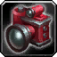

  
  Camera

**Camera** is a lightweight World of Warcraft addon that gives you precise control over camera behavior through a clean options panel.

Adjust mouse look speeds, zoom distance, smoothing, and several camera physics options that are normally hidden or difficult to change.

---

## Features

- Enable / Disable the addon with one click
- **Yaw Speed** – Horizontal mouse look sensitivity
- **Pitch Speed** – Vertical mouse look sensitivity
- **Max Zoom Factor** – How far you can zoom out
- **Zoom Speed** – Mouse wheel zoom speed
- **Yaw & Pitch Smooth Speed** – Camera smoothing
- Toggle options:
  - Camera Bobbing
  - Terrain Tilt
  - Camera Pivot
  - Water Collision
- **Apply Now** button – Instantly apply changes
- **Defaults** button – Reset to Blizzard’s standard values
- Fully localized (see supported languages below)
- Ability to force a specific language for the addon (including Japanese)

---

## Slash Commands

| Command             | Description                          |
| ------------------- | ------------------------------------ |
| `/cam` or `/camera` | Open the configuration window        |
| `/cam locale`       | Show current forced locale           |
| `/cam locale jaJP`  | Force Japanese (or any other locale) |
| `/cam locale reset` | Return to the client’s real locale   |

---

## Configuration

Open the options with `/cam` or through the standard AddOns menu (Interface → AddOns → Camera).

All settings are saved per character profile via AceDB.

---

## Supported Languages

The addon includes translations for:

- English (enUS)
- German (deDE)
- French (frFR)
- Spanish (esES / esMX)
- Portuguese (ptBR)
- Italian (itIT)
- Russian (ruRU)
- Korean (koKR)
- Simplified Chinese (zhCN)
- Traditional Chinese (zhTW)
- Japanese (jaJP)

You can force any of these languages with the `/cam locale` command (useful for testing or if you prefer a different language than your client).

---

## Supported Game Versions

- Classic Era
- Season of Discovery / Classic Fresh
- Cataclysm Classic
- Mists of Pandaria Classic
- The War Within (Retail)
- Midnight (and current Retail)

---

## Dependencies

- **Ace3** (OptionalDeps – will use embedded version if not already loaded)

---

## Installation

1. Download the latest release
2. Extract the `Camera` folder into your `World of Warcraft/_classic_/Interface/AddOns/` or `_retail_/Interface/AddOns/` directory
3. Restart the game or type `/reload`
4. Type `/cam` to open the options

---

## Author

**RamblinRose**

---

## Feedback & Issues

If you find a bug or have a suggestion, please open an issue on the repository.
